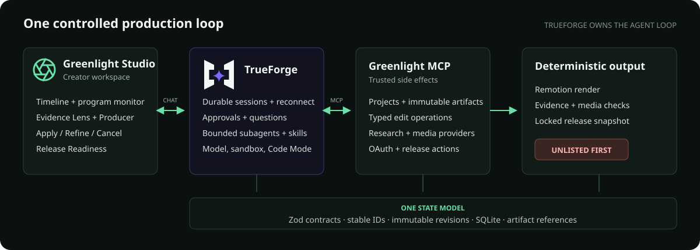
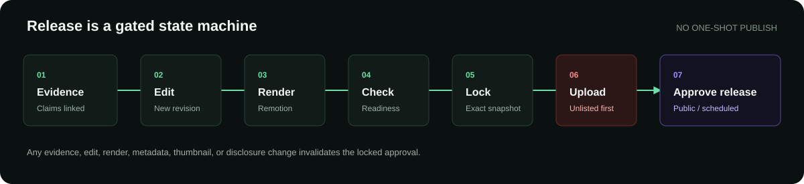

<p align="center">
  
</p>

<h1 align="center">Greenlight</h1>

<p align="center"><strong>A TrueForge-native YouTube production studio where evidence, editing, rendering, and release share one controlled loop.</strong></p>

<p align="center">
  Research → sourced script → editable timeline → checked render → unlisted review
</p>

<p align="center">
  <a href="https://greenlight.aryankumar.dev"><strong>Open the live demo</strong></a> · Judge credentials are prefilled on the login screen
</p>

Greenlight is a real multi-track editor with a visible Producer agent. Direct gestures and Producer proposals use the same typed edit contract, every accepted change creates an immutable revision, and the creator keeps final release control.

## The demo surface

- **Evidence Lens** — click a scene to inspect its supported claims and source links.
- **Reviewable agent work** — research, scripts, questions, progress, and approvals remain visible in the durable TrueForge thread.
- **Typed editing** — move, trim, split, mute, transition, caption, and gap operations share one command model.
- **Credible audio** — waveforms, loudness normalization, and music ducking under narration.
- **Release Readiness** — evidence, captions, audio, black frames, metadata, render, and disclosure checks in one view.
- **Three thumbnail candidates** — prepare and select among three YouTube-ready options.
- **Reconnect proof** — refresh during research and continue the same TrueForge turn.
- **Safe release** — stage unlisted first; public or scheduled release needs approval for the exact locked snapshot.

## Architecture

TrueForge visibly owns the agent loop. Greenlight MCP owns trusted state and side effects. Remotion produces the deterministic render.



Both creator edits and Producer edits resolve to `EditorPatchOperation`, so the editor never maintains a hidden second state model.



The live deployment serves the Studio and signed multipart uploads from a Cloudflare Worker. Private R2 is the canonical home for originals; Greenlight verifies and hydrates a project-scoped hot-file cache on the VPS before media work. A header-gated Cloudflare Tunnel reaches the containerized TrueForge + Greenlight origin, which exposes no public service port.

## Run locally

Requirements: Node.js 22+, pnpm 9+, FFmpeg/FFprobe, and an owner-configured model route.

```bash
pnpm install
cp .env.example .env
openssl rand -hex 32 # set output as GREENLIGHT_MCP_AUTH_TOKEN in .env
```

Set `OPENROUTER_API_KEY` in `.env`. Greenlight uses that single local secret for the TrueForge root model, GPT Image 2, voice, and transcription. Never commit it.

Start TrueForge once, configure the saved Producer from another terminal, then run the judged stack:

```bash
pnpm trueforge
pnpm trueforge:configure

# Stop the first TrueForge process before starting the complete stack.
pnpm demo
```

| Service           | URL                         |
| ----------------- | --------------------------- |
| Greenlight Studio | `http://localhost:4173`     |
| Greenlight MCP    | `http://localhost:8941/mcp` |
| TrueForge         | `http://localhost:8790`     |

TrueForge 0.1.4 clones Git-backed skills only from public GitHub or GitLab repositories. While this repository is private, configuration safely detaches the four skills. Run `pnpm trueforge:configure` again if the submission repository becomes public.

## Demo path

1. Start sourced research, then refresh to prove durable reconnect.
2. Open the completed script for creator review before production.
3. Click a scene and open its claims in Evidence Lens.
4. Make one direct timeline edit, then preview one Producer edit and Apply it.
5. Normalize narration and duck music while showing the waveform.
6. Open Release Readiness and the three thumbnail candidates.
7. Lock the snapshot and stage the upload as unlisted.

## Repository

```text
apps/studio         React editor and TrueForge event projection
apps/edge           Cloudflare auth, static assets, proxy, and signed R2 upload
apps/mcp            Runnable MCP/API service and trusted side effects
apps/render         Deterministic Remotion renderer
packages/contracts  Shared Zod schemas and editing invariants
agents              Saved Producer definition and four lazy skills
deploy              Container and private-origin configuration
scripts             Repeatable setup and demo utilities
```

The complete quality gate runs formatting, lint, types, tests, and every workspace build:

```bash
pnpm verify
```

## Safety contract

- Models receive immutable artifact IDs, never credentials or host paths.
- Claim-to-source coverage is required before render and public release.
- Upload is always unlisted first.
- Changing evidence, edit state, media, render, metadata, thumbnail, or disclosure invalidates release approval.
- No video-delete or channel-wide mutation tool exists.

## Harness and review

<p>
  <a href="https://trueforge.dev/">
    <picture>
      <source media="(prefers-color-scheme: dark)" srcset="assets/readme/trueforge-dark.svg" />
      
    </picture>
  </a>
  &nbsp;&nbsp;&nbsp;&nbsp;
  <a href="https://www.qodo.ai/media-kit/">
    <picture>
      <source media="(prefers-color-scheme: dark)" srcset="assets/readme/qodo-dark.svg" />
      
    </picture>
  </a>
</p>

TrueForge runs the Producer harness. Qodo reviews the submission pull request: [aryan877/greenlight#1](https://github.com/aryan877/greenlight/pull/1).

Brand assets above come from the official [TrueForge repository](https://github.com/truefoundry/trueforge/tree/main/docs/logo) and [Qodo media kit](https://www.qodo.ai/media-kit/).

References: [TrueForge documentation](https://trueforge.dev/llms.txt) · [Hackathon resources](https://www.wemakedevs.org/hackathons/trueforge/resources)
